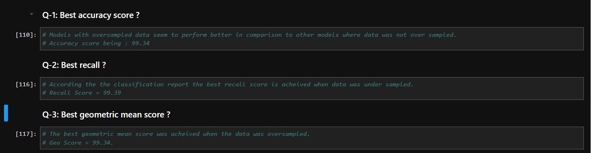
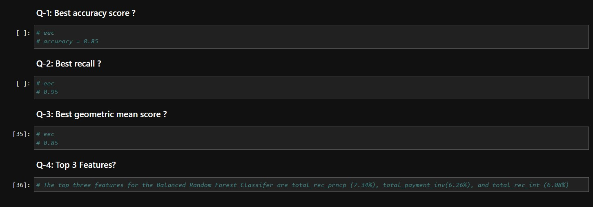

# Classification:
1. The purpose of the assignment was to evaluate the result of different models with balanced and imbalanced data sets.
2. Two General models usedd for this pupose are:
    1. Logistic Regression.
    2. Balanced Random Forest Classifier.
3. Logistic Regression:
    1. After importing the required libraries and dependencies.
    2. Logistic Regression was trained with the provided data.
    3. Model was evaluated.
    4. Furthermore, manipulatoin of data was carried out in following ways:
        1. OverSampling.
        2. UnderSampling.
        3. SMOTE.
        4. Combination of over and under Sampling.
    5. The same model was used for predictions on manipulated data sets and the results were evaluated using 3 metrics:
        1. Classification Report.
        2. Balanced Accuracy Score.
        3. Confusion Matrix.
    6. Following findings were observed in terms of performance of the model:
    
4. Balanced Random Forest Classifier and Easy Ensemble Classifier:
    1. After following the required steps of feature and target selection,splitting of data sets , the two models were trained and tested on the data sets.
    2. These models were then evaluated using the same metrics as mentioned before.
    3. Following results were obtained as the result of evaluation.
    
